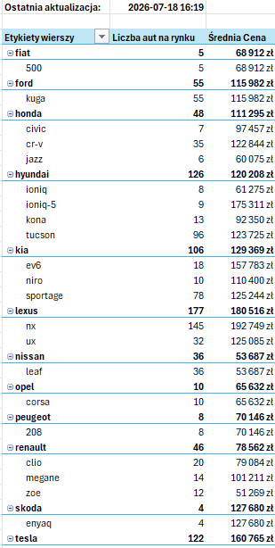
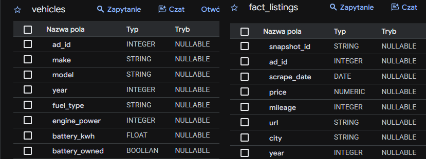

# EV Market Intelligence 

[EN] TL;DR: Automated end-to-end data pipeline scraping EV market data from Otomoto. It uses asynchronous Python to gather data, loads it into Google BigQuery data warehouse, and generates automated business reports in Excel via VBA macros.

## Opis projektu

Projekt to w pełni zautomatyzowane rozwiązanie analityczne, którego celem jest codzienne monitorowanie rynku samochodów zelektryfikowanych (elektrycznych EV oraz hybrydowych HEV) w Polsce. Narzędzie samodzielnie pozyskuje dane z portalu ogłoszeniowego, przetwarza je, zasila hurtownię danych w chmurze, a następnie serwuje gotowe zestawienia analityczne dla ostatecznego użytkownika biznesowego w postaci zautomatyzowanego arkusza kalkulacyjnego. 

Architektura została zaprojektowana z myślą o niezawodności, optymalizacji zapytań sieciowych oraz łatwości w utrzymaniu, co odzwierciedla rynkowe standardy budowania procesów zasilania danymi.

## Architektura i przepływ danych

System składa się z trzech głównych modułów, które wykonują się w ściśle określonej sekwencji:

1. **Pozyskiwanie i Przetwarzanie (Python)**
   - Punktem wejścia jest skrypt uruchamiany codziennie w nocy przez zautomatyzowane środowisko GitHub Actions.
   - Moduł sieciowy oparty na bibliotekach asynchronicznych odpytuje portal w oparciu o plik konfiguracyjny z listą obserwowanych modeli.
   - Zaimplementowany mechanizm dynamicznej paginacji przechodzi przez kolejne strony wyników, gwarantując pobranie pełnego wolumenu ofert omijając nałożone limity wyświetlania.
   - Pozyskany kod HTML jest parsowany, a wydobyte metadane są poddawane rygorystycznemu czyszczeniu (m.in. mapowanie typów, weryfikacja statusu wynajmu baterii).

2. **Hurtownia Danych (Google BigQuery)**
   - Wyczyszczone i zwalidowane rekordy trafiają do chmury Google przy użyciu dedykowanego klienta API.
   - Dane ładowane są z zachowaniem podziału na tabelę faktów (zmienne w czasie parametry takie jak cena, przebieg, data pobrania) oraz tabelę wymiarów (statyczne atrybuty jak moc silnika, marka, model).
   - Zastosowano logikę weryfikacyjną chroniącą bazę przed duplikacją operacji zapisu w ramach jednego dnia roboczego.

3. **Warstwa Raportowa (Excel VBA)**
   - Końcowym produktem jest interaktywny plik analityczny, który omija potrzebę logowania do zewnętrznych interfejsów chmurowych przez analityka.
   - Przy otwarciu pliku ukryty skrypt VBA nawiązuje połączenie z Google BigQuery poprzez interfejs ODBC.
   - Skrypt czyści środowisko robocze, pobiera najświeższy widok danych i w pełni automatycznie przebudowuje tabelę przestawną wraz z nadaniem widocznego stempla czasowego ostatniej aktualizacji.

## Wartość informacyjna i biznesowa

Narzędzie w obecnej formie pozwala na natychmiastową weryfikację stanu rynku wtórnego. Główne metryki dostarczane przez raport to:
- Precyzyjny wolumen dostępnych pojazdów w rozbiciu na konkretne marki i modele.
- Średnia cena rynkowa dla poszczególnych modeli bazująca na aktualnych danych z bieżącego dnia.
- Podstawa do identyfikacji makroekonomicznych trendów podażowych na rynku pojazdów nisko- i bezemisyjnych.

*Rys 1. Podgląd wygenerowanego automatycznie raportu biznesowego w programie Excel.*

## Struktura Repozytorium

- `.github/workflows/` - definicja zadań CRON odpowiadających za automatyzację całego procesu.
- `config/` - pliki konfiguracyjne określające zbiory danych wejściowych (manifest modeli aut).
- `data/` - pliki z danymi testowymi i zrzutami środowiska.
- `excel/` - pliki raportowe dla użytkowników końcowych.
- `src/` - główny kod źródłowy aplikacji (logika, komunikacja sieciowa, operacje bazodanowe).
- `vba_scripts/` - kody źródłowe wdrożone w warstwie raportowej zapisane w postaci czystego tekstu.
- `main.py` - główny punkt startowy aplikacji wywołujący potok asynchroniczny.
- `requirements.txt` - lista wymaganych pakietów środowiska Python.

*Rys 2. Struktura zaimplementowanych tabel faktów i wymiarów w hurtowni Google BigQuery.*

## Kolejne kroki i rozwój projektu

Po zgromadzeniu odpowiedniego wolumenu danych historycznych (zapewniającego odpowiednią próbę statystyczną), projekt zostanie rozbudowany o następujące elementy:
- **Analiza Cyklu Życia Ogłoszenia:** Badanie czasu potrzebnego na sprzedaż konkretnego modelu i monitorowanie zjawiska obniżania ceny bazowej w czasie.
- **Wymiary lokalizacyjne:** Rozszerzenie zestawień o dane geograficzne, co pozwoli mapować podaż pojazdów na poszczególne regiony kraju.
- **Ewolucja warstwy wizualnej:** Wdrożenie interaktywnego dashboardu przy pomocy technologii klasy BI (np. Power BI).